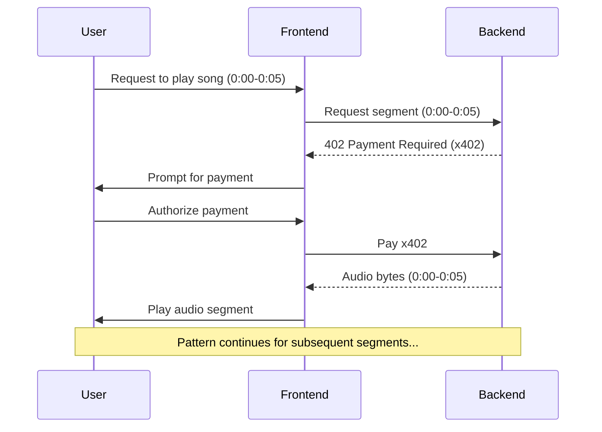

# xByte Introduction

xByte, the infra-as-a-service protocol.

Facilitates "Pay-per-Byte" x402 payments, allows content-agnostic monetization model for platforms (Netflix, Spotify, Twitch, etc.), instead of monthly subscriptions!

e.g.: Pay 0.001 USDC per 1MB of a movie.


### How to Run

Requires Node and Rust to be installed.

```bash
$ git clone https://github.com/Arvmor/xbyte.git
$ cd xbyte

# For server (runs at localhost:80)
$ cd xbyte-server
$ cargo run --release

# For SDK (builds the SDK package)
$ cd xbyte-web/xbyte-sdk
$ pnpm i
$ pnpm build

# For Demo website (runs at localhost:3000)
$ cd xbyte-web
$ pnpm i
$ pnpm dev
```

## Description

xByte is the pay-per-byte infra that enables monetization through x402 for any content that can be converted to bytes. (video, music, live streams, etc.)

The xByte TypeScript SDK lets platforms integrate directly with the xByte infrastructure, set per-byte pricing, control access to their content, and seamlessly receive payments. Think Netflix movies, Spotify songs, Twitch streams, ..., all metered by the byte!

### For Platforms

- Entertainment platforms can reach users who prefer to pay only for what they consume, eliminating the incentive to share/borrow accounts for lower prices to game the system.
- Drop-in infrastructure, not a competing app. xByte is rails, not a destination. Platforms own their UX; we provide metered billing as a service.

### For Users

- Users pay only for what they watch or listen to, whether it's their favorite show or songs during Saturday evening workouts at the gym.
- Web2 friendly, Fund your account with a card or PayPal. Under the hood it's USDC and x402, but users never need to know it's crypto.

### For Creators & Rights Holders

- Artists receive transparent, on-chain royalties and can set dynamic pricing. If a moment in their content goes viral, they earn more as viewers rewind and rewatch that specific segment, paying for every second.

### For AI Agents

- AI agents can access content across platforms and pay royalties directly to artists, filmmakers, and streamers.

## Tech Stack

- Backend (Rust, Actix)
- SDK (TypeScript)
- Frontend (NextJS, Privy)
- File Storage (DB / S3, TBD)
- x402

## Architecture


