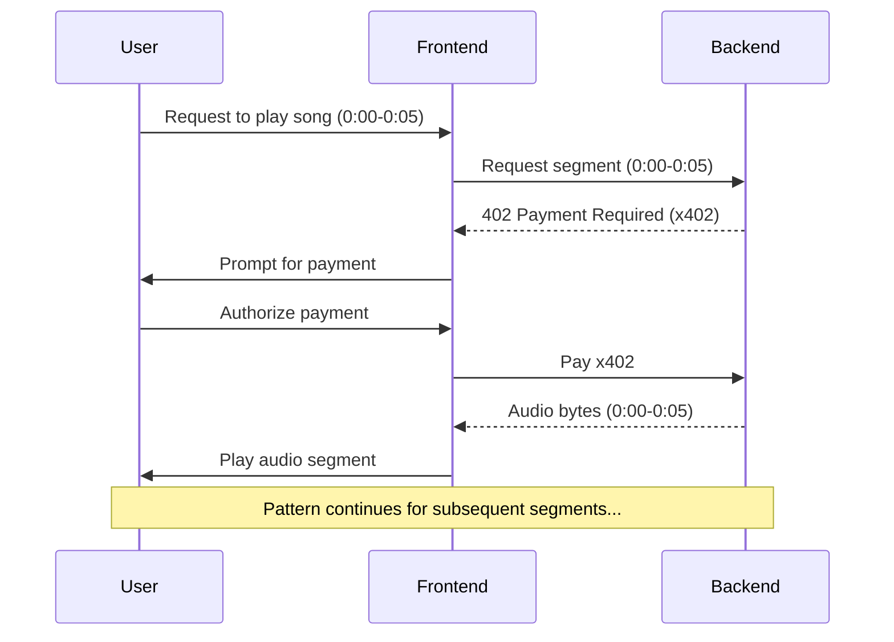

# Introduction

Tunity, the Pay-per-Byte Streaming Platform.

Building an End-to-End Streaming Platform, that takes advantage of x402 and Privy wallets, which allows users to pay as they listen to their favorite music! (aka Pay-per-Byte)

### How to Run

Requires Node and Rust to be installed.

```bash
$ git clone https://github.com/Arvmor/tunity.git
$ cd tunity

# For server (runs at localhost:80)
$ cd tunity-server
$ cargo run --release

# For website (runs at localhost:3000)
$ cd tunity-web
$ npm i
$ npm run dev
```

## Description

With "Per-pay-Byte" mechanics, users are only required to pay royalties based on their "Real-time" usage, this could mean paying $0.0001 per N seconds (adjusted by artist) or $0.001 per N bytes (flexibility for 360p, 720p, etc.).

In conclusion, Tunity is aiming to be the next streaming platform that provides royalties transparency, inexpensive and no-commitment subscriptions! Allowing single product to be accessed by the user (or AI Agent), and transparent royalty movements to artists.

### Tech Stack

- Backend (Rust, Actix)
- Frontend (NextJS, Privy)
- File Storage (DB / S3, TBD)
- x402

## Architecture


